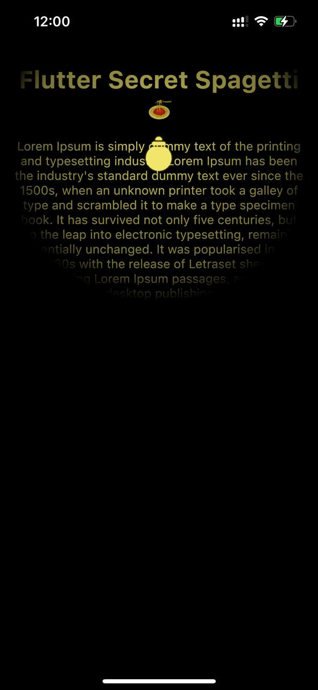

# Light Bulb Effect

This Flutter project illustrates a light bulb effect.
Pictures and Video below will allow you to understand better.

If you're wondering how this magic happens, it is basically a `ShaderMask` with some other usual stuff to make the app usable.

## Screenshots 📸

| Lights off                                       | Lights On                                        | Lights On 2                                      |
| ------------------------------------------------ | ------------------------------------------------ | ------------------------------------------------ |
|  |  |  |

## Video 🎥

| Preview                                                        |
| -------------------------------------------------------------- |
| <video src="readme_assets/showcase_video.MOV" width="300px" /> |
